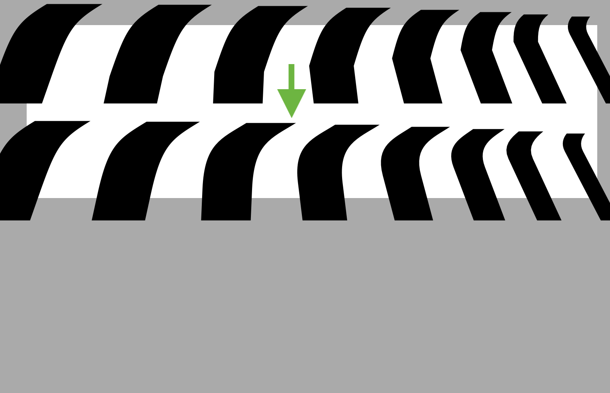

# RealignHandles

This is a [Glyphs.app](http://glyphsapp.com/) filter for fixing interpolation kinks by realigning handles next to (green) curve nodes.

It is most useful as a custom parameter post interpolation. (Note that the parameter does not work in variable font exports because there is no post interpolation in VFs.)

### Installation

1. One-click install *Realign Handles* from *Window > Plugin Manager*
2. Restart Glyphs.

### Usage Instructions

#### in Edit view

1. Open a glyph for editing.
2. Choose *Filter > Realign Handles.* Hold down Opt key for applying to all master layers at once.

#### as custom parameter

1. In *File > Font Info > Exports,* in one of the instances, add a *Filter* custom parameter.
2. As its value, enter `RealignHandles`.
3. If you want to limit it to certain glyphs only, add a semicolon, `include:` followed by comma-separated glyph name list, e.g., `RealignHandles; include: germandbls, dagger`

The custom parameter only works for static instances.

### License

Copyright 2025 Rainer Erich Scheichelbauer (@mekkablue).
Based on sample code by the Glyphs team (glyphsapp.com).

Licensed under the Apache License, Version 2.0 (the "License");
you may not use this file except in compliance with the License.
You may obtain a copy of the License at

http://www.apache.org/licenses/LICENSE-2.0

See the License file included in this repository for further details.
